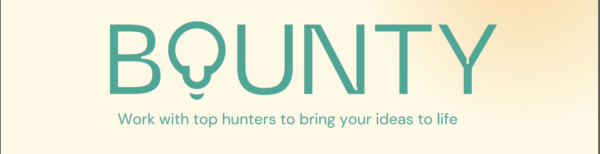

<!-- TITLE -->

<!-- TABLE OF CONTENTS -->

  
Table of Contents

  <ol>
    <li>
      About The Project
      <ul>
        <li><a href="#traditional-task-delegation-inefficiencies">Problem Statement</a></li>
        <li><a href="#proposed-solution">Proposed Solution</a></li>
        <li><a href="#summary">Summary</a></li>
        <li><a href="#key-takeaway-and-what-next">Key Takeaway And What Next</a></li>
      </ul>
    </li>
    <li><a href="#what-does-it-do">How it works</a></li>
    <li><a href="#technologies-used">Technologies Used</a></li>
    <li><a href="#problems-encountered">Problems Encountered</a></li>
    <li><a href="#contact">Contact</a></li>
  </ol>

<!-- ABOUT THE PROJECT -->
## Project Links
[https://bwc-7.vercel.app](https://bwc-7.vercel.app)    

[Demo](https://youtu.be/aZDpJOYxeZo)

## Pitch
https://www.canva.com/design/DAFsEdwAmqQ/Yxdf1wDB5Jr983OMVoh76g/edit?utm_content=DAFsEdwAmqQ&utm_campaign=designshare&utm_medium=link2&utm_source=sharebutton

## Traditional Task Delegation Inefficiencies

In today's interconnected world, traditional methods of task delegation often lead to inefficiencies, geographical limitations, and lack of transparency. Businesses, organizations, and individuals seeking specific expertise face challenges in identifying suitable candidates, ensuring quality work, and managing payments.   
Additionally, talented individuals from diverse backgrounds encounter barriers to accessing meaningful projects and opportunities due to geographic constraints and intermediaries.

This problem hinders collaboration, slows down project completion, and restricts the global workforce from contributing to projects they are passionate about. Furthermore, the opacity of traditional systems can result in mistrust and payment disputes, further hindering smooth collaboration.

## Proposed Solution

Through the decentralized bounty platform, I'm addressing these challenges by leveraging blockchain technology and smart contracts by creating a secure and transparent environment that connects talent with tasks, regardless of their location. The platform empowers Bounty Posters to outline tasks, while enabling Applicants to showcase their skills and compete for projects they're passionate about. 

By eliminating intermediaries, I'm fostering efficient collaboration, accelerating project completion, and ensuring fair and timely compensation for quality work.

## Summary
In summary, the platform aims to revolutionize task delegation, foster a global community of collaboration, and enable seamless interactions between talent and opportunities.

(<a href="#top">back to top</a>)

# What does it do
Imagine you're a backend developer wanting to build a nice portfolio site, let's assume css sucks for backend developers, You can simply get to the platform, uplos the instruction (Problem Description), Acceptance Criteria, Technical Details and Milestones, Attach a fee to it and post on the platform. There's a share button on the platform which you can use to grab the link to the bounty and share on your social media for outreach and also a share button to share on X (formally twitter). As expected, applicants are to be frontend developers and Interested applicants submitt application messages to prove to you they're the right choice. You can thereafter go through all submitted application messages, reject or ignore the ones you seemed not to be a good fit and accept the one that seemed to be the best fit, __Note__: accepting an applicant doesn't get the applicant paid. Thereafter the applicant gets to work on your task and submit as expected, when the submission is made, you can go through the submission. If the submission doesn't seemed to be good to your taste, you can surely request a review which the applicant would be notified and got to make fixes as mentioned. If the submission meets your expectation, you can thereafter accept the submission and the applicant gets paid immediately. **It's a win win for the two parties, You got your expected portfolio site running and the applicant gets rewarded in amount of cUSD you attached**.

## Key Takeaway and What Next
- Bounty is a fully decentralized bounty platform with no web2 infastructure or middle man making it fully decentralized.
- This will really help the community at large in a great way as it's a win-win platform for both bounty posters and applicants
- Intend to build this further after the hackathon.

## Technologies Used

Using Celo composer with Material UI and NextJS for the front-end, IPFS to keep large data and Hash stored onchain.

- [Celo](https://celo.org/)
- [Next.js](https://nextjs.org/)
- [Material UI](https://mui.com/)
- [Rainbowkit-celo](https://github.com/celo-org/rainbowkit-celo)
- [Celo Composer](https://github.com/celo-org/celo-composer)
- [IPFS](https://ipfs.tech/)

Other
- [Deployed Contract Address on Alfajores Explorer](https://alfajores.celoscan.io/address/0x962203284c5f32fd03b4388DCbe992941527824D)

(<a href="#top">back to top</a>)

## Problems Encountered
Found it a bit technical using persisting data on chain and using the data from different contracts to be displayed on the client as they're residing in different contracts created by a factory contract.

<!-- CONTACT -->
## Contact

- [Twitter](https://twitter.com/Qudusayo)
- [Contact Form](https://www.qudusayo.me/contact-me)

(<a href="#top">back to top</a>)

